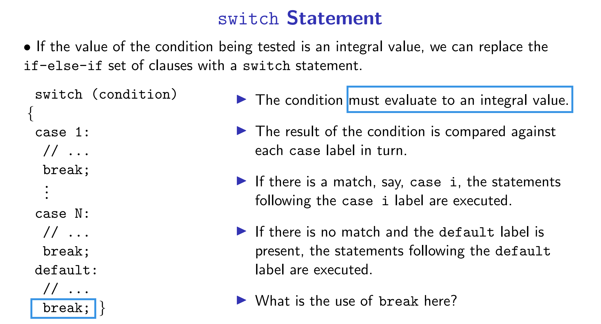

# 啥也不会版

* iostream is a standard C++ input/output library, consisting of a collection of related classes that support input and output to the console and to files.

* If the value of the condition being tested is **an integral value**, we can replace the if-else-if set of clauses with a switch statement.

* continue statement short-circuits the remaining execution of the current iteration.

* A pointer holds a memory address, something like, e.g., 0x00a0fb64

* & is the address-of operator, which retrieves the address of the object following it.

* A pointer that addresses no object has the value 0 and is called a null pointer.

* A reference serves as an indirect handle to an object. A reference **must be assigned when defined and cannot be reassigned**.

* an int variable occupies **4 bytes(32bits)** of memory with **1 bit** assigned to the sign. int elem; An unsigned int variable occupies 4 bytes of memory (32 bits of memory).

* declare of a function means make function known to compiler

* When a function is invoked, the program stack is set up to hold the memory of the values of each function parameter and each object defined within the function. • When the function completes, this special area of memory called stack is discarded. • Here, we used the pass by value semantics. • So, there is no connection between the objects manipulated within swap() and the objects passed to it within bubble_sort(). • Changes that were made within swap() are not saved or not reflected.

* Declaring a parameter as a reference can eliminate the overhead of copying a large object, hence is more efficient.

* Stack memory is a special area of memory where a function is temporarily placed on during its execution,  in a last-in-first-out manner:

  * Local objects defined within the function are stored in **stack memory**. 
  * When the function completes, memory is discarded and the objects no longer exist.

* **Scope**: The region of the program in which an object is visible is called its scope.

* The time interval during which memory is allocated for an object is called its **extent.**

* An object defined outside a function (including main() funtion) has a file scope and is visible from the point of its definition to the end of the current file.

* An object created on the heap is said to have a dynamic extent because 

  * it is allocated at run time through the use of the new expression, 
  * and it continues to exist, 
  * until it is deallocated through the use of the delete expression.

* The default value can be specified only once – either in the declaration or in the definition of the function, but not both.(C2,p36)

* An object local to the function is discarded as soon as the function terminates; while a local static object has the memory that persists across function invocations.(C2, p39)

  For example,

  ```c++
  void function(){
      vector<int> elems;//local obj
      static vector<int> static_elems;//static local obj. Warning: only the first time calling the function, the static_elems will be init! Later when using this function, static_elems has been initialized already!
  }
  ```

  After calling the function, the `static_elems` will not be destroyed; and keep its value.

* `inline`: The keyword `inline` requests the compiler to expand functions at each call point. (C2, P46)The definition of an inline function is usually placed within a header file.

* Overload:Two or more functions can be given the same name if the parameter list of each function is unique either by the type or by the number of parameters.

* template: A function template is a mechanism to **factor out the type information** of all or a subset of the types specified in the parameter list.(C2, P54)

  `template<typename elemType>`（同java中的`<T>`，java中的T可以换成任何你喜欢的名称，同样，c++也可以把elemType换成任何你喜欢的名称。）

  eg：

  ```c++
  template<typename T>
  T myMax(T x, T y){
      return x>y?x:y;
  }
  
  //call this function:
  int main(){
      int a = 1, b = 2;
      cout << myMax<int>(a,b)<<endl;
      return 0;
  }
  ```

* Function Pointers(Pointers to functions)

  How to declare a pointer to a function?

  ```c++
  returnType (*functionName)(parameterList);
  ```

  For example, I'd like to make a function whose return type is the **pointer** of `const vector<int>`, function name is `fibon_seq`, parameter is `size` with type `int`:

  ```c++
  const vector<int>* (*fibon_seq)(int size);
  ```

* An **iterator** is a class object that **points to an element inside the container** and we can use iterators to move through the elements of the container.(C3, P19)

* C3 p33-p36应该不是重点

* Copy constructor: a copy constructor is a member function that initializes an object using another object of the same class.

  ```c++
  Triangular::Triangular(const Triangular& rhs)
  {
      m_length = rhs.m_length;
      m_beg_pos = rhs.m_beg_pos;
      m_next = rhs.m_beg_pos - 1;
  }
  ```

* The const class object can only invoke const versions of member functions and the non-const class object can only invoke non-const versions of member functions.（C4 P33）

* ==prefix(++it) and postfix(it++)==前者自增后返回，后者返回后自增

  ```c++
  Triangular_iterator& operator++(); // prefix increment operator
  Triangular_iterator operator++(int); // postfix increment operator
  ```

* typedef introduces an alternative name for a type and takes the general form(C4 P58)

  ```
  typedef void (*Function_Ptr) (int);
  ```

  Then, void (*fun_ptr) (int) is the same as Function_Ptr fun_ptr.

* A class can designate functions/classes as friends. Then the friends of a class can access the private members in the same way as the member functions of that class.(C4 p61, `friend`)

* A **function object** is an object of a class that provides an overloaded instance of the function call operator ().(C4 p69)


## Lab

P43 视频中采用了隐表达式，它的写法等价于：

```c++
int main(){
    
    {
        //视频原写法：ScopedPtr e = new Entity();
        Entity* ett = new Entity();
        ScopedPtr e(ett);
    }
    return 0;
}
```

作用域结束的时候，ScopedPtr会被释放，会调用`ett`对象中析构函数中`delete e`的操作以释放指针e。

P46 讲述了`->`的作用。

`(*Pointer).` = `Pointer->`

# Appendix

## Keywords

`using`, `namespace`,


# Questions

1 condition应该能够使char， bool，long long， long等吧；最后一行的break写和不写有无区别。




# Vocabulary

dereference: 解引用